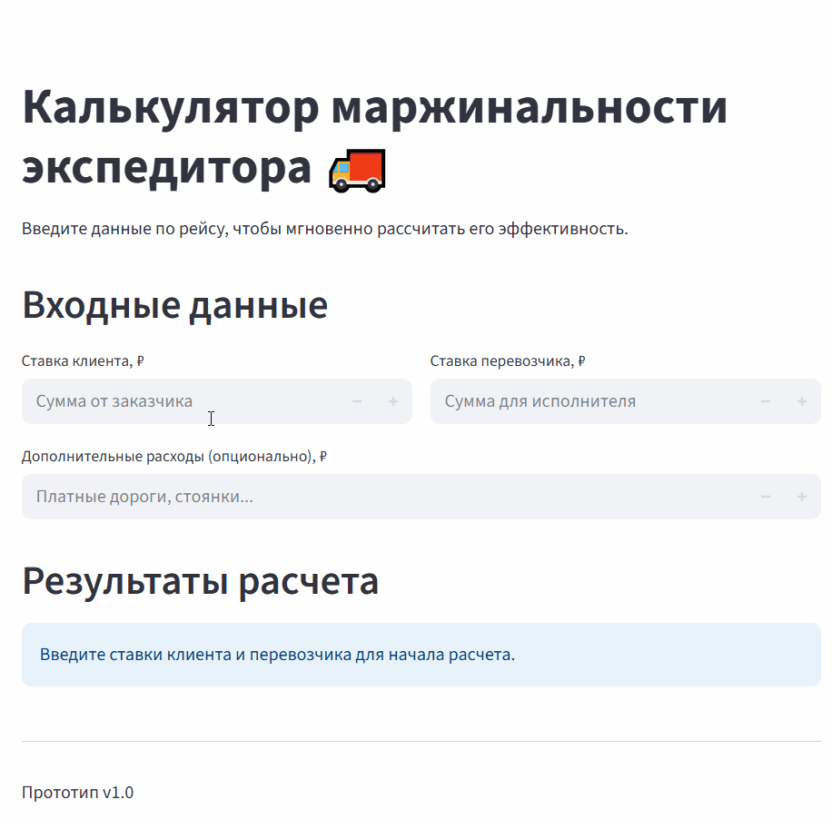

# Калькулятор маржинальности экспедитора (MVP v1) 🚚


Этот проект — MVP веб-приложения, разработанного для быстрой оценки прибыльности логистических сделок. Основная цель проекта заключалась в проверке гипотезы: "Нужен ли экспедиторам простой инструмент для мгновенного расчета маржинальности, чтобы принимать более выгодные решения в реальном времени?".

**➡️ [Попробовать калькулятор онлайн](https://log-calc.streamlit.app/) ⬅️**



## 🎯 Ключевые возможности MVP v1

*   **Мгновенный расчет:** Ввод ставки клиента и перевозчика для немедленного получения результата.
*   **Расчет ключевых метрик:** Автоматический расчет чистой прибыли (маржи) и маржинальности в процентах.
*   **Наглядный индикатор:** Цветной индикатор (✅ ВЫГОДНО / ❌ УБЫТОЧНО) для быстрой оценки сделки.
*   **Учет доп. расходов:** Возможность добавить непредвиденные затраты для максимальной точности расчета.
*   **Адаптивный интерфейс:** Удобно пользоваться как с компьютера, так и с мобильного телефона.

## 🛠️ Технологический стек

*   **Python:** Язык, на котором написана вся логика.
*   **Streamlit:** Фреймворк для быстрого создания интерактивных веб-приложений.

## 📈 Результаты и следующие шаги: Успешный "Пивот"

В ходе демонстрации MVP реальному пользователю (владельцу логистической компании) была получена ценная обратная связь. Выяснилось, что, хотя инструмент и полезен, ключевая потребность бизнеса заключается не в оценке маржинальности существующих сделок, а в **создании ценового предложения с нуля**.

Этот инсайт является **главным успехом проекта**, так как он позволил на самой ранней стадии скорректировать вектор развития и избежать разработки ненужного функционала.

На основе полученных данных было разработано техническое задание для **MVP v2: "Калькулятор Ценообразования"**, который решает реальную, подтвержденную проблему пользователя.

➡️ **[Ознакомиться с ТЗ на MVP v2](MVP_v2_SPEC.md)**

## 🚀 Как запустить локально

1.  **Клонируйте репозиторий:**
    ```bash
    git clone https://github.com/IDSidorov-data/logistics_calculator.git
    cd logistics_calculator
    ```

2.  **Создайте и активируйте виртуальное окружение:**
    ```bash
    # Для Windows
    python -m venv venv
    venv\Scripts\activate

    # Для macOS / Linux
    python3 -m venv venv
    source venv/bin/activate
    ```

3.  **Установите зависимости:**
    ```bash
    pip install -r requirements.txt
    ```

4.  **Запустите приложение:**
    ```bash
    streamlit run app.py
    ```